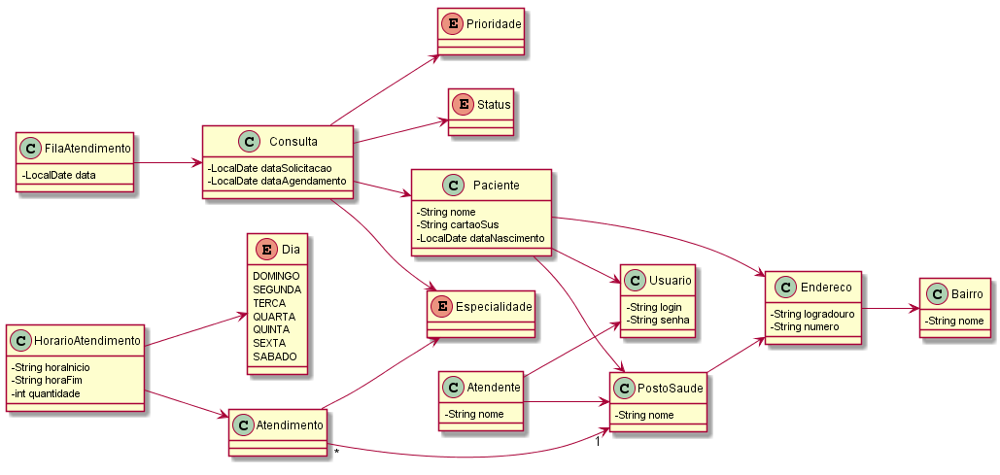

# Saúde Garanhuns

  Aplicação desenvolvida com o objetivo de ajudar a controlar os agendamentos de consultas nos postos de saúde da cidade de Garanhuns-PE.


## Motivação

  - A população da cidade de Garanhuns-PE tem dificuldade em marcar uma consulta médica, pois é preciso se deslocar até um posto de saúde e a quantidade de fichas é limitada;
  - Idosos e gestantes são expostos a situação de risco para realizar o agendamento;


## Como contribuir?

  Siga os seguintes passos:

  1. Faça um fork do projeto (basta clicar no botão de fork do GitHub)
  2. Clone o seu fork deste projeto (`$ git clone https://github.com/seu-login/saudegaranhuns.git`)
  3. Abra uma issue (no projeto original) descrendo do que se trata a sua contribuição
  4. Pegue o ID (código) da issue que você abriu e crie um branch na sua máquina com este código (`$ git checkout -b ID`)
  5. Realize as mudanças que você deseja fazer
  6. Faça os commits dessas mudanças
  7. Verifique se não há conflitos entre o seu branch local com o branch master upstream (o código original) (`$ git fetch upstream` e `$ git rebase upstream/master`)
  8. Verifique se o código está compilando e passando nos testes (`$ mvn clean package`)
  9. Envie o branch modificado para o seu repositório (`$ git push origin ID`)
  10. No GitHub, vá ao site do projeto original, e abra um Pull Request (PR). No comentário do PR, faça a referência a issue aberta (Escreva "Conforme a issue #ID" (sem as aspas))

  Para sincronizar as bases, siga os seguintes passos:

  1. Adicione (apenas uma vez) o repositório original na lista de seus repositórios remotos (`$ git remote add upstream https://github.com/ifpe-cti/saudegaranhuns.git`)
  2. Baixe o código do repositório original (`$ git fetch upstream`)
  3. Vá para o branch que você quer sincronizar (`$ git checkout master`)
  4. Faça um rebase do repositório original com o seu (`$ git rebase upstream/master`)
  5. Sincronize o seu repositório remoto com o seu local (`$ git push origin master`)


## Executando

  Para executar a aplicação, primeiro utilize o maven para construir a aplicação:
  ```bash
  $ ./mvnw clean package
  ```

  Depois de construido, utilize o `jar` que se encontra no diretório `target`, assim:
  ```bash
  $ java -jar target/saudegaranhuns-1.0-SNAPSHOT.jar
  ```

  **Observação**: Há um [bug](https://github.com/joinfaces/joinfaces/issues/310) referente ao Spring Boot / Joinfaces que não permite que a aplicação seja executada em diretórios cujo nome possua algum caractere em branco. Assim, certifique-se, antes de executar, que não há caracteres em branco no PATH da execucação da aplicação. Para maiores detalhes, veja a issue [#90](https://github.com/ifpe-cti/saudegaranhuns/issues/90).


## Documentação

  A documentação do sistema é composta do arquivo README.md (este arquivo) e dos diagramas UML que são gerados pelo [PlantUML](http://plantuml.com) que estão armazenados na pasta `docs/uml`. Caso precise gerar a documentação, deverá utilizar o seguinte comando:  
  ```
  $ ./mvnw clean package -Pdocs
  ```

### Diagrama de Classes
  


## Convenções

  - Utilizar notação camelCase
  - Nome do método no infinitivo e em português
  - Constantes com MAIÚSCULO
  - Cobertura de 80% de testes
  - Utilizar Hibernate
  - Utilizar PrimeFaces 
  - Utilizar Maven + Git
  - Utilizar MySQL
  - Utilizar NetBeans
  - Utilizar o padrão DAO
  - Utilizar o padrão MVC


## Contribuidores

  - [@lsoaresesilva](https://github.com/lsoaresesilva) como Leonardo Soares e Silva  
  - [@fabriciofx](https://github.com/fabriciofx) como Fabrício Cabral  
  - [@jofernando](https://github.com/jofernando) como José Fernando Mendes da Costa  
  - [@HeriklesVinicyus](https://github.com/HeriklesVinicyus) como Hérikles Vinicyus França Cordeiro
  - [@Igor201](https://github.com/Igor201) como Igor Silva de Sousa  
  - [@jjunio01](https://github.com/jjunio01) como Jose Junio Araujo da Silva  
  - [@Lucianocljr](https://github.com/Lucianocljr) como Luciano Júnior


## Licença

